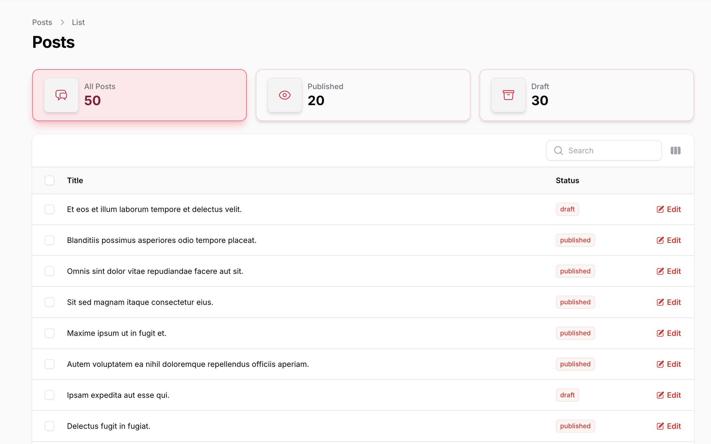
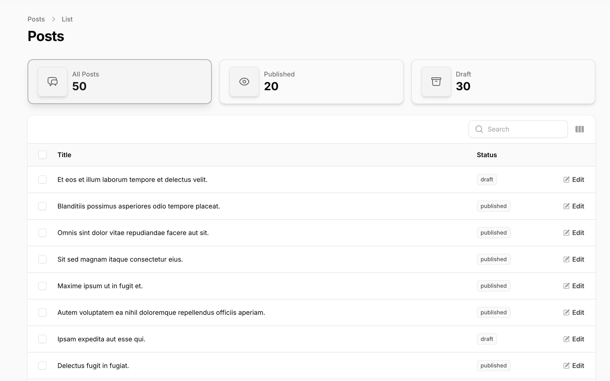

# Widget Tabs Plugin

 

## Installation

You can install the package via composer:

```bash
  composer require shkubu18/filament-widget-tabs
```

In an effort to align with Filament's theming methodology you will need to use a custom theme to use this plugin.

> [!IMPORTANT]
> If you have not set up a custom theme and are using a Panel follow the instructions in
> the [Filament Docs](https://filamentphp.com/docs/3.x/panels/themes#creating-a-custom-theme).

1. Import the plugin's stylesheet in your theme's css file.

```css
@import '<path-to-vendor>/shkubu18/filament-widget-tabs/resources/css/widget-tabs.css';
```

2. Add the plugin's views to your `tailwind.config.js` file.

```js
content: [
    '<path-to-vendor>/shkubu18/filament-widget-tabs/resources/**/*.blade.php',
]
```

### Publishing Views

If you need to customize the views, you can publish them with:

```bash
  php artisan vendor:publish --tag=filament-widget-tabs-views
```

## Usage

Filament Widget Tabs works similarly
to [Filament Tabs](https://filamentphp.com/docs/3.x/panels/resources/listing-records#using-tabs-to-filter-the-records),
but displays each tab as a “widget” that can filter your resource’s table with a single click.

### Add the `HasWidgetTabs` trait

Add the `HasWidgetTabs` trait to your Filament resource page.

### Implement the `getWidgetTabs()` method

Define your widget tabs by implementing the `getWidgetTabs()` method in your page class.
Each tab is created with the `WidgetTab::make()` component, allowing you to specify label, icon, value, and filtering
behavior:

```php
use App\Enums\PostStatusEnum;
use Illuminate\Database\Eloquent\Builder;
use Filament\Resources\Pages\ListRecords;
use Shkubu\FilamentWidgetTabs\Concerns\HasWidgetTabs;
use Shkubu\FilamentWidgetTabs\Components\WidgetTab;

class ListPosts extends ListRecords
{
    use HasWidgetTabs;

    public function getWidgetTabs(): array
    {
        return [
            'all' => WidgetTab::make()
                ->label('All Posts')
                ->icon('heroicon-o-chat-bubble-left-right')
                ->value(Post::count()),
            'published' => WidgetTab::make()
                ->label('Published')
                ->icon('heroicon-o-eye')
                ->value(Post::where('status', PostStatusEnum::PUBLISHED)->count())
                ->modifyQueryUsing(fn (Builder $query): Builder => $query->where('status', PostStatusEnum::PUBLISHED)),
            'drafts' => WidgetTab::make()
                ->label('Drafts')
                ->icon('heroicon-o-archive-box')
                ->value(Post::where('status', PostStatusEnum::DRAFT)->count())
                ->modifyQueryUsing(fn (Builder $query): Builder => $query->where('status', PostStatusEnum::DRAFT)),
        ];
    }
}
```

That's all you need to get started with Widget Tabs! Your resource list page will now display beautiful widget-style
tabs that filter your table data just like default Filament tabs, but with the added benefit of displaying important
data values within each tab widget.

## Features

### Auto-loading Default Active Widget Tab

By default, widget tabs will not automatically load a default active widget tab when the page mounts. If you want to
enable automatic loading of the default widget tab, you can override the `shouldAutoLoadDefaultActiveWidgetTab` method
in your page class:

```php 
protected function shouldAutoLoadDefaultActiveWidgetTab(): bool
{
    return true; // Enable auto-loading of the default active widget tab
}
```

### Widget Tabs Layout

You can customize how many widget tabs appear in each row by overriding the `getWidgetsPerRow()` method in your page
class:

```php
 protected function getWidgetsPerRow(): int|array
 { 
    return 4; // Default is 3 widgets per row
 }
```

It is also possible to specify an array of breakpoints for different display sizes:

```php
 protected function getWidgetsPerRow(): int|array
 { 
    return ['sm' => 2, 'md' => 3, 'lg' => 4];
 }
```

### Labels

Add a descriptive label to your widget tab:

``` php
WidgetTab::make()
    ->label('Published Posts')
```

### Icons

Add an icon to visually enhance your widget tab:

``` php
WidgetTab::make()
    ->icon('heroicon-o-document-text')
```

You can also specify the icon size:

``` php
use Filament\Support\Enums\IconSize;

WidgetTab::make()
    ->icon('heroicon-o-document-text')
    ->iconSize(IconSize::Large)
```

### Values

Display a count or other relevant value in your widget tab:

``` php
WidgetTab::make()
    ->value(Post::count())
```

You can control the decimal precision of numeric values:

``` php 
WidgetTab::make()
    ->label('Average Rating')
    ->value(Post::avg('rating'))
    ->precision(2) // Will display with 2 decimal places, e.g., "4.75"
```

### Percentages

When enabled, the percentage method formats your value as a percentage, displaying it with a % symbol instead of as a
regular number:

``` php
WidgetTab::make()
    ->value(25)
    ->percentage() // This will display as "25%" instead of "25"
```

You can control the decimal precision of percentage values independently from regular numeric values, giving you
fine-grained control over how different types of data are displayed:

```php 
WidgetTab::make()
    ->label('Published Ratio')
    ->value(fn (): float => (Post::where('status', 'published')->count() / Post::count()) * 100) 
    ->percentage() 
    ->percentagePrecision(1) // Will display as "25.4%" instead of "25%"
```

### Theming

Widget Tabs supports advanced theming with pre-built color schemes and gradients.

#### Pre-built Color Schemes

Apply different color themes to your widget tabs:

``` php
WidgetTab::make()
    ->label('Success Posts')
    ->value(Post::where('status', 'published')->count())
    ->success()

WidgetTab::make()
    ->label('Failed Posts')
    ->value(Post::where('status', 'failed')->count())
    ->danger()
    
WidgetTab::make()
    ->label('Draft Posts')
    ->value(Post::where('status', 'draft')->count())
    ->info()
    //...
```

**Preview:**

<div align="center">

|                                     **Success Theme**                                      |                                        **Danger Theme**                                        |                                    **Info Theme**                                    |
|:------------------------------------------------------------------------------------------:|:----------------------------------------------------------------------------------------------:|:------------------------------------------------------------------------------------:|
|  |        |  |
|                                     **Warning Theme**                                      |                                      **Secondary Theme**                                       |                                                                                      |
|  |  |                                                                                      |

</div>


You can also use the generic `theme()` method with enum or string values:

``` php
use Shkubu\FilamentWidgetTabs\Enums\WidgetTabTheme;

WidgetTab::make()
    ->theme(WidgetTabTheme::Success) // Using enum
```

#### Gradient Effects

Add beautiful gradient backgrounds to your widget tabs:

``` php
WidgetTab::make()
    ->label('Premium Posts')
    ->value(Post::where('is_premium', true)->count())
    ->success()
    ->gradient() // Adds gradient effect
```

**Preview:**


#### Custom Theme Classes

For advanced customization, you can add custom CSS classes:

``` php
WidgetTab::make()
    ->label('Custom Styled')
    ->value(100)
    ->customThemeClasses([
        'custom-shadow',
        'custom-border',
        'my-special-theme'
    ])

// Or use a closure for dynamic classes
WidgetTab::make()
    ->customThemeClasses(fn () => [
        'dynamic-class-' . now()->format('Y'),
        'user-role-' . auth()->user()->role
    ])
```

#### Available Themes

- **Secondary**: Neutral gray theme for secondary content
- **Success**: Green theme for positive states and success messages
- **Warning**: Yellow/orange theme for warnings and attention
- **Danger**: Red theme for errors and critical states
- **Info**: Blue theme for informational content

### Extra Attributes

Add extra HTML attributes to your widget tab:

``` php
WidgetTab::make()
    ->extraAttributes(['attribute' => 'value'])
```

### Query Modification

Filter the resource table based on the selected tab:

``` php
WidgetTab::make()
    ->modifyQueryUsing(fn (Builder $query): Builder => $query->where('status', 'published'))
```

Or use the shorter `query()` method:

``` php
WidgetTab::make()
    ->query(fn (Builder $query): Builder => $query->where('status', 'published'))
```

## Contributing

Please see [CONTRIBUTING](.github/CONTRIBUTING.md) for details.

## Security Vulnerabilities

Please review [our security policy](../../security/policy) on how to report security vulnerabilities.

## Credits

- [Data Shkubuliani](https://github.com/shkubu18)
- [All Contributors](../../contributors)

## License

The MIT License (MIT). Please see [License File](LICENSE.md) for more information.
